# 02 — Complete Dependency Graph (Phase 11)

**Target Subsystem:** Enterprise Pricing Engine (`App\Domain\Services\PriceCalculator`)  
**Date:** 2026-07-10  

---

## 1. Current Dependency Graph (Pragmatic Overlay Architecture)

```mermaid
graph TD
    subgraph Application ["App\Application Layer"]
        QueryHandler["GetProductPriceQueryHandler"]
        DTO["CalculatePriceDto"]
    end

    subgraph Domain ["App\Domain Layer (Contaminated)"]
        PriceCalc["PriceCalculator"]
        MoneyVO["Money (Value Object)"]
    end

    subgraph Infrastructure ["Infrastructure & Vendor Framework"]
        LaravelDB["Illuminate\Support\Facades\DB"]
        BagistoProductRepo["Webkul\Product\Repositories\ProductRepository"]
        BagistoCustomerRepo["Webkul\Customer\Repositories\*Repository"]
        BagistoCore["core() Helper / Webkul\Core\Core"]
    end

    QueryHandler -->|calls| PriceCalc
    QueryHandler -->|passes| DTO
    PriceCalc -->|imports & depends on| DTO
    PriceCalc -->|instantiates| MoneyVO
    PriceCalc -->|Direct SQL Query| LaravelDB
    PriceCalc -->|Direct ORM Lookup| BagistoProductRepo
    PriceCalc -->|Service Locator app()| BagistoCustomerRepo
    PriceCalc -->|Global Helper| BagistoCore

    classDef contaminated fill:#3b1e1e,stroke:#f66,stroke-width:2px;
    class PriceCalc contaminated;
```

---

## 2. Proposed Dependency Graph (Pure Ports & Adapters / Hexagonal Architecture)

```mermaid
graph TD
    subgraph Application ["App\Application Layer"]
        QueryHandler["GetProductPriceQueryHandler"]
        DTO["CalculatePriceDto"]
    end

    subgraph Domain ["App\Domain Layer (100% Pure & Framework-Ignorant)"]
        PriceCalc["PriceCalculator (Pure Domain Service)"]
        MoneyVO["Money (Value Object)"]
        PricingPort["Contracts\ProductPricingPortInterface"]
        InventoryPort["Contracts\ProductInventoryPortInterface"]
    end

    subgraph Infrastructure ["App\Infrastructure\Pricing (Adapters)"]
        BagistoPricingAdapter["BagistoProductPricingAdapter"]
        BagistoInventoryAdapter["BagistoProductInventoryAdapter"]
    end

    subgraph Vendor ["Vendor / Laravel Framework"]
        LaravelDB["Illuminate\Support\Facades\DB"]
        BagistoRepos["Webkul Eloquent Repositories & core()"]
    end

    QueryHandler -->|calls| PriceCalc
    PriceCalc -->|instantiates| MoneyVO
    PriceCalc -->|calls port| PricingPort
    PriceCalc -->|calls port| InventoryPort

    BagistoPricingAdapter ..->|implements| PricingPort
    BagistoInventoryAdapter ..->|implements| InventoryPort

    BagistoPricingAdapter -->|encapsulates| BagistoRepos
    BagistoInventoryAdapter -->|encapsulates| LaravelDB

    classDef pureDomain fill:#1e3b28,stroke:#6f6,stroke-width:2px;
    classDef adapter fill:#1e2b3b,stroke:#69f,stroke-width:2px;
    class PriceCalc,MoneyVO,PricingPort,InventoryPort pureDomain;
    class BagistoPricingAdapter,BagistoInventoryAdapter adapter;
```



---

## 3. Dependency Inversion Improvements Highlighted
1. **Elimination of Framework Imports in Domain:** `PriceCalculator` no longer imports `Illuminate\Support\Facades\DB` or any `Webkul\*` package.
2. **Elimination of Service Locator (`app()`) & Global Helpers (`core()`):** All customer group and channel resolution is encapsulated inside `BagistoProductPricingAdapter`.
3. **Pure Unit Testability:** `PriceCalculator` can be tested using in-memory mock implementations of `ProductPricingPortInterface` and `ProductInventoryPortInterface` in `< 1 millisecond` without booting Laravel container.
