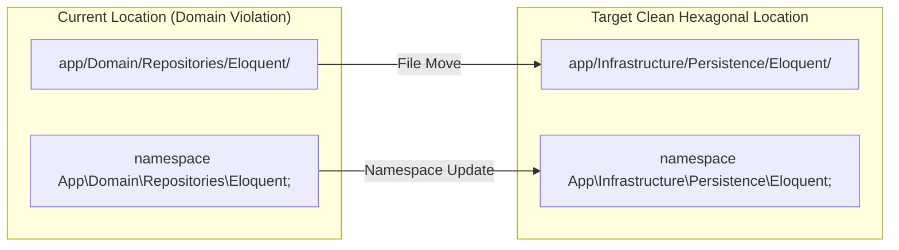

# Phase 14 — Deliverable 03: Namespace & Directory Migration Plan

---

## 1. Migration Overview

To transform the repository layer from Pragmatic DDD into a clean Hexagonal Architecture, concrete ORM repository implementations must be moved out of `app/Domain/Repositories/Eloquent/` and into `app/Infrastructure/Persistence/Eloquent/`.

---

## 2. Exact File & Namespace Mapping Table

| # | File Name | Current Relative Path | Target Relative Path | Current Namespace | Target Namespace |
| :---: | :--- | :--- | :--- | :--- | :--- |
| **1** | `BrandRepository.php` | `app/Domain/Repositories/Eloquent/` | `app/Infrastructure/Persistence/Eloquent/` | `App\Domain\Repositories\Eloquent` | `App\Infrastructure\Persistence\Eloquent` |
| **2** | `BrandSeriesRepository.php` | `app/Domain/Repositories/Eloquent/` | `app/Infrastructure/Persistence/Eloquent/` | `App\Domain\Repositories\Eloquent` | `App\Infrastructure\Persistence\Eloquent` |
| **3** | `BuildRepository.php` | `app/Domain/Repositories/Eloquent/` | `app/Infrastructure/Persistence/Eloquent/` | `App\Domain\Repositories\Eloquent` | `App\Infrastructure\Persistence\Eloquent` |
| **4** | `CompatibilityRepository.php` | `app/Domain/Repositories/Eloquent/` | `app/Infrastructure/Persistence/Eloquent/` | `App\Domain\Repositories\Eloquent` | `App\Infrastructure\Persistence\Eloquent` |
| **5** | `DistrictRepository.php` | `app/Domain/Repositories/Eloquent/` | `app/Infrastructure/Persistence/Eloquent/` | `App\Domain\Repositories\Eloquent` | `App\Infrastructure\Persistence\Eloquent` |
| **6** | `ProductInventoryRepository.php` | `app/Domain/Repositories/Eloquent/` | `app/Infrastructure/Persistence/Eloquent/` | `App\Domain\Repositories\Eloquent` | `App\Infrastructure\Persistence\Eloquent` |
| **7** | `ProductSerialRepository.php` | `app/Domain/Repositories/Eloquent/` | `app/Infrastructure/Persistence/Eloquent/` | `App\Domain\Repositories\Eloquent` | `App\Infrastructure\Persistence\Eloquent` |
| **8** | `UpazilaRepository.php` | `app/Domain/Repositories/Eloquent/` | `app/Infrastructure/Persistence/Eloquent/` | `App\Domain\Repositories\Eloquent` | `App\Infrastructure\Persistence\Eloquent` |

---

## 3. PSR-4 Autoloading Impact Assessment
- **Autoload Rule in `composer.json`:** `"App\\": "app/"`
- **Assessment:** Moving directories from `app/Domain/Repositories/Eloquent` to `app/Infrastructure/Persistence/Eloquent` automatically maps to `App\Infrastructure\Persistence\Eloquent` via PSR-4.
- **Composer Requirement:** Zero edits to `composer.json`. Standard Composer class map discovery handles the location change.
