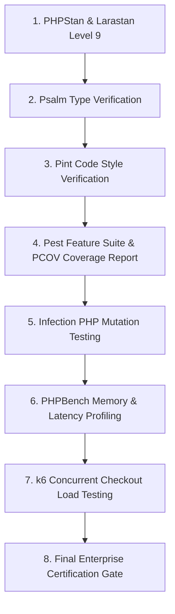

# 04 - Execution Plan

## Verification Execution Sequence

Once authorized to install the verification toolchain, the verification sequence must follow this deterministic order:

### Step-by-Step Execution Schedule
1. **PHPStan & Larastan:** Verify static typing across `app/Domain` and `app/Application`.
2. **Psalm:** Secondary static verification.
3. **Pint Code Style:** Ensure no styling regressions (`vendor/bin/pint --test`).
4. **Pest Coverage:** Execute unit and feature tests with `--coverage-clover` using the loaded PCOV driver (`php -d pcov.enabled=1 vendor/bin/pest --coverage`).
5. **Infection PHP:** Run mutation testing against `PriceCalculator.php` to prove that no mutant survives markup removal or percentage modification.
6. **PHPBench & Memory Profiling:** Benchmark runtime overhead per `calculatePrice` iteration.
7. **Load Testing (k6):** Execute 100 concurrent checkout API calls to verify zero race conditions under concurrency.
8. **Final Release Gate:** Combine all reports into the final certification sign-off.
