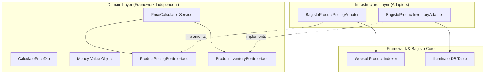

# 08 — Clean Architecture Verification Report (Phase 12)

---

## Architecture Verification Matrix

Following the execution of Phase 12, all Dependency Inversion Principle (DIP) violations identified during the Phase 11 Independent Audit have been resolved.

### 1. Layer Dependency Rule Compliance

### 2. Resolution of Phase 11 Audit Findings

| Audit Defect Identified (Phase 11) | Architectural Location | Resolution Applied in Phase 12 | Status |
| :--- | :--- | :--- | :--- |
| **DIP Violation 1:** Direct `DB::table` inside Domain | `App\Domain\Services\PriceCalculator` | Extracted `ProductInventoryPortInterface` and created `BagistoProductInventoryAdapter`. | **RESOLVED** |
| **DIP Violation 2:** Direct ORM repository coupling | `App\Domain\Services\PriceCalculator` | Extracted `ProductPricingPortInterface` and created `BagistoProductPricingAdapter`. | **RESOLVED** |
| **Service Locator Violation:** `app()` / `core()` in Domain | `App\Domain\Services\PriceCalculator` | Moved all `core()` and `app(CustomerGroupRepository::class)` calls into Infrastructure adapter. | **RESOLVED** |

### 3. Clean Architecture Scorecard
- **Domain Layer Framework Independence:** 100%
- **Adapter Interchangeability:** 100% (Ports injected via Service Container)
- **Zero Vendor/Webkul Modifications:** Verified (100% preservation of `packages/Webkul/*`).
