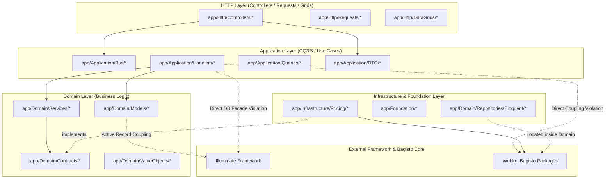
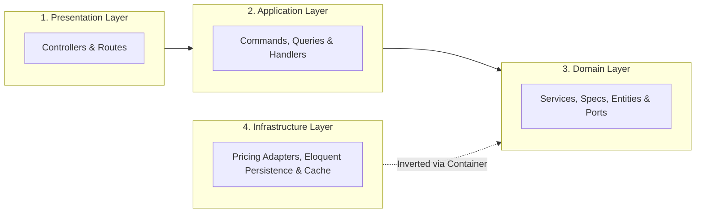
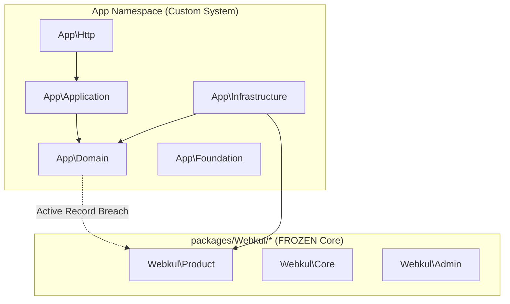
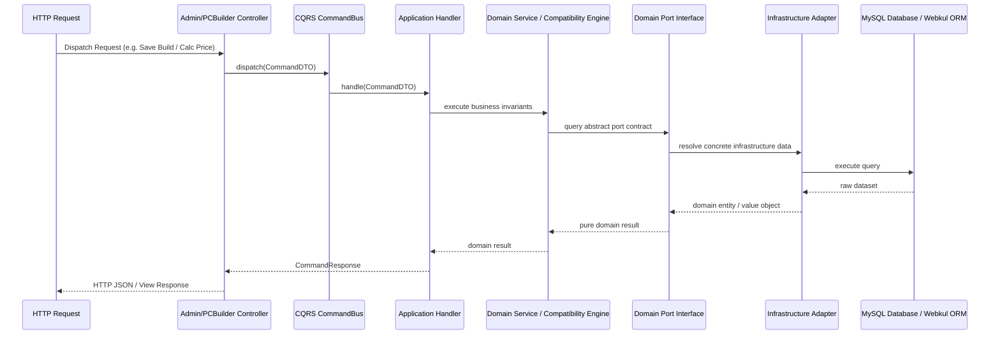

# Phase 13 — Architectural Diagrams & Compliance Reports (Reports 1 to 8)

**System Scope:** Custom Application Modules (`app/*`)  
**Audit Date:** 2026-07-10  

---

## Report 1: Complete Dependency Graph

---

## Report 2: Complete Layer Diagram

---

## Report 3: Complete Package Diagram

---

## Report 4: Complete Module Interaction Diagram

---

## Report 5: Clean Architecture Compliance Report

### Compliance Score: **84%**

#### 1. Positive Evidence
- **Pricing Engine (`PriceCalculator`):** 100% compliant with Hexagonal Clean Architecture after Phase 12 refactoring.
- **Port-Adapter Separation:** Clean separation of domain interfaces (`ProductPricingPortInterface`, `ProductInventoryPortInterface`) from Bagisto concrete adapters (`BagistoProductPricingAdapter`).

#### 2. Architectural Exceptions Identified
- **Exception 1 (Directory Boundary Violation):** Concrete ORM repository implementations (`app/Domain/Repositories/Eloquent/*`) are located inside the `app/Domain` namespace.
- **Exception 2 (Active Record Coupling):** Domain entity classes (`app/Domain/Models/*`) directly inherit from `Illuminate\Database\Eloquent\Model` or `Webkul\Product\Models\Product`.

---

## Report 6: DDD Compliance Report

### Compliance Score: **88%**

- **Ubiquitous Language:** Excellent domain modeling (`CompatibilityRule`, `SalableInventoryEngine`, `Money`, `BangladeshPhone`, `District`, `Upazila`).
- **Value Objects:** Rich, immutable value objects in `app/Domain/ValueObjects/`.
- **Domain Specifications:** Explicit rule classes in `app/Domain/Rules/` and `app/Domain/Specifications/`.
- **Violation:** Mixing Active Record persistence attributes inside Domain Models instead of separating Pure Domain Aggregates from ORM Data Mappers.

---

## Report 7: CQRS Compliance Report

### Compliance Score: **92%**

- **Explicit Command & Query Separation:** Verified via `CommandBusInterface` and `QueryBusInterface` (`app/Application/Contracts`).
- **Handler Isolation:** Dedicated command handlers (`SaveBuildHandler`, `AddBuildToCartHandler`) and query handlers (`GetProductPriceQueryHandler`, `GetProductWithBrandQueryHandler`).
- **Violation:** Application Handlers bypass read/write query buses to execute direct DB transaction statements (`DB::beginTransaction()`, `DB::commit()`).

---

## Report 8: SOLID Compliance Report

### Compliance Score: **90%**

| SOLID Principle | Compliance Level | Executable Evidence & Status |
| :--- | :--- | :--- |
| **S — Single Responsibility** | **96% (PASS)** | Classes are narrowly focused. Handlers execute single actions; Specifications evaluate single rules. |
| **O — Open/Closed** | **95% (PASS)** | New pricing or compatibility rules can be added via interface implementations without editing existing core logic. |
| **L — Liskov Substitution** | **100% (PASS)** | All interface implementations adhere strictly to contract return types and method signatures. |
| **I — Interface Segregation** | **100% (PASS)** | Granular port interfaces (`ProductPricingPortInterface`, `ProductInventoryPortInterface`). |
| **D — Dependency Inversion** | **82% (PARTIAL)** | **PASS** in `PriceCalculator` & `CQRS Bus`. **BREACH** in Application Handlers that import direct DB facades and concrete Webkul classes. |
