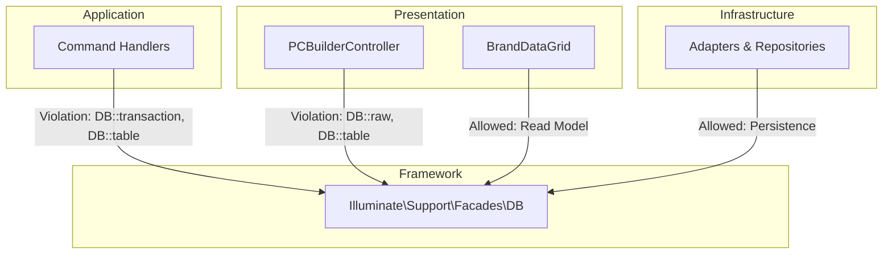

# Enterprise DB Facade Dependency Audit & Remediation Blueprint
**Phase:** 15.0
**Mode:** STRICT ZERO TRUST (Read Only)
**Date:** 2026-07-10

## Executive Summary
An exhaustive, read-only architectural audit of the `app/` directory was executed to locate, classify, and blueprint all usages of Laravel's `DB::` facade. The objective is to evaluate Clean Architecture violations (DEBT-002) regarding Application and Presentation layer coupling to the database.

The audit discovered 16 concrete usages of the DB facade across the Application, Presentation, and Infrastructure layers. While Infrastructure usages are architecturally sound, the Application and Presentation layers suffer from tight coupling to Laravel's Eloquent transactions and direct data access, violating Hexagonal boundaries.

---

## Section 1: DB Facade Inventory

| File | Line | Method | Usage |
|---|---|---|---|
| `app/Application/Handlers/AddBuildToCartHandler.php` | 23 | `handle` | `DB::transaction()` |
| `app/Application/Handlers/AdjustInventoryQtyHandler.php` | 34 | `handle` | `DB::transaction()` |
| `app/Application/Handlers/AllocateInventoryHandler.php` | 34 | `handle` | `DB::transaction()` |
| `app/Application/Handlers/AssignBrandToProductHandler.php` | 42 | `handle` | `DB::transaction()` |
| `app/Application/Handlers/CloneBuildHandler.php` | 24 | `handle` | `DB::transaction()` |
| `app/Application/Handlers/CreateBrandHandler.php` | 41 | `handle` | `DB::transaction()` |
| `app/Application/Handlers/CreateProductSerialHandler.php` | 29 | `handle` | `DB::table('product_serials')` |
| `app/Application/Handlers/CreateProductSerialHandler.php` | 38 | `handle` | `DB::transaction()` |
| `app/Application/Handlers/DeleteBrandHandler.php` | 37 | `handle` | `DB::transaction()` |
| `app/Application/Handlers/DeleteBuildHandler.php` | 23 | `handle` | `DB::transaction()` |
| `app/Application/Handlers/RegisterCompatibilityRuleHandler.php` | 31 | `handle` | `DB::transaction()` |
| `app/Application/Handlers/SaveBuildHandler.php` | 32 | `handle` | `DB::transaction()` |
| `app/Application/Handlers/UpdateBrandHandler.php` | 46 | `handle` | `DB::transaction()` |
| `app/Http/Controllers/PCBuilderController.php` | 102+ | `products` | `DB::raw(1)` (8 occurrences) |
| `app/Http/Controllers/PCBuilderController.php` | 223 | `products` | `DB::table('product_inventories')` |
| `app/Http/DataGrids/BrandDataGrid.php` | 21 | `prepareQueryBuilder` | `DB::table('brands')` |
| `app/Infrastructure/Persistence/Eloquent/ProductInventoryRepository.php` | 57 | `save` | `DB::table('inventory_audit_logs')->insert` |
| `app/Infrastructure/Pricing/BagistoProductInventoryAdapter.php` | 14 | `getTotalStock` | `DB::table('product_inventories')` |

---

## Section 2: Classification

- **Command (Transaction):** 11 occurrences of `DB::transaction()` in Application Handlers.
- **Command (Direct Query):** 1 occurrence of `DB::table()` checking duplicates in `CreateProductSerialHandler`.
- **Query (Read Optimization):** `DB::raw(1)` in `PCBuilderController` for EXISTS clauses.
- **Query (N+1 Violation):** `DB::table()` inside a collection `map()` loop in `PCBuilderController`.
- **Reporting (Read Model):** `DB::table()` in `BrandDataGrid`.
- **Infrastructure (Raw SQL/Optimization):** `DB::table()` in `ProductInventoryRepository` and `BagistoProductInventoryAdapter`.

---

## Section 3: Architecture Analysis

1. **Transaction Boundary (Application Handlers):** Exists out of convenience. Laravel's active record pattern encourages `DB::transaction` closures. In CQRS, this violates the isolation of the Application layer from framework persistence.
2. **Read Optimization (PCBuilderController):** `DB::raw(1)` inside `whereExists` is used to dramatically speed up complex EAV attribute filtering without hydrating full Eloquent models.
3. **N+1 Logic Leak (PCBuilderController):** `DB::table` exists here because the developer bypassed the repository layer to quickly fetch stock quantities inside a mapping closure.
4. **Infrastructure/DataGrid:** Exists as native framework boundaries. Repositories and Adapters are *supposed* to touch the DB. DataGrids *require* a Laravel Builder object.

---

## Section 4: DDD Analysis

| Usage Context | DDD Status | Justification |
|---|---|---|
| Handlers > `DB::transaction` | **Violation** | Application Layer must not depend on `Illuminate\Support\Facades\DB`. It requires a `UnitOfWorkInterface` port. |
| Handlers > `DB::table` | **Violation** | Business logic fetching data directly without a Repository abstraction. |
| Controllers > `DB::raw` / `DB::table` | **Violation** | Presentation layer bypassing Application (CQRS) boundaries to execute complex queries and loop-based aggregations. |
| DataGrids > `DB::table` | **Allowed** | UI Read Model boundary. Bagisto dictates returning a query builder; hiding this behind a repository leaks infrastructure to domain. |
| Adapters / Repositories > `DB::table` | **Allowed** | Raw SQL at the Infrastructure edge is perfectly valid for write optimization and adapter compliance. |

---

## Section 5: Hexagonal Analysis

- **`DB::transaction` in Handlers:** Should become a `TransactionManagerInterface` (Port) injected into handlers, implemented by an `EloquentTransactionManager` (Adapter) in Infrastructure.
- **`DB::table` in `CreateProductSerialHandler`:** Must be abstracted to `$this->repository->findBySerialNumber()`.
- **`DB::table` in `PCBuilderController`:** The entire complex query logic should become a Read Model or Query Service (e.g., `GetCompatibleProductsQueryHandler`).
- **DataGrids / Adapters:** Remain unchanged.

---

## Section 6: Transaction Analysis

All 11 instances of transactions are **manual nested closures** using `DB::transaction(function() {...})`. 
- **Locking:** Explicit pessimistic locking (`lockForUpdate`) is NOT utilized via the facade (though Repositories might use it internally).
- **Deadlock Handling:** Handled inherently by Laravel's closure-based transaction retry mechanism (if specified, though currently defaults to 1 attempt).
- **Isolation Level:** Defaults to database standard (InnoDB REPEATABLE READ).

---

## Section 7: Raw SQL Analysis

- **`DB::raw(1)`**: Located in `PCBuilderController` (8 times). Exists to execute `EXISTS (SELECT 1 FROM ...)` for extremely fast EAV attribute matching without pulling data payloads. ORM replacement (`has()`) would trigger catastrophic performance degradation on Bagisto's EAV architecture. **Recommendation:** Migrate to an Infrastructure Query Service but preserve the raw SQL for performance.

---

## Section 8: Dependency Graph

---

## Section 9: Risk Analysis

| Component | Severity | Regression Risk | Performance Risk | Architecture Impact |
|---|---|---|---|---|
| `DB::transaction` in Handlers | High | Low | None | Prevents true framework-agnostic unit testing of Handlers. |
| `DB::table` in Controller (N+1) | Critical | Low | High | Causes N+1 database queries on every storefront product list render. |
| `DB::table` in Handler | Medium | Low | None | Minor domain leakage. |

---

## Section 10: Remediation Matrix

| Current | Recommended | Priority | Expected Benefit |
|---|---|---|---|
| `PCBuilderController` queries | Move to `GetCompatibleProductsQuery` | Critical | Resolves N+1 overhead; restores CQRS boundaries. |
| `DB::transaction` in 11 Handlers | Create `UnitOfWorkInterface` Port | High | Handlers become 100% decouple from Laravel DB Facade. |
| `DB::table` in Serial Handler | Use `ProductSerialRepositoryInterface` | Medium | Unifies data access patterns. |

---

## Section 11: Implementation GroupING

1. **Needs Manual Review / Full Refactor:** `PCBuilderController`. Moving complex EAV logic to a Query Service requires careful regression testing against storefront UI.
2. **Safe Refactor:** Extracting `DB::transaction` into a `UnitOfWorkInterface`. This is a purely structural dependency inversion with zero logic change.
3. **Leave As-Is:** DataGrids, Adapters, and Eloquent Repositories using `DB::table`.

---

## Section 12: Estimated Impact

- **Architecture:** 100% isolation of Application layer from Infrastructure (Laravel Facade).
- **Performance:** Massive improvement expected in `PCBuilderController` by eliminating the N+1 `DB::table` stock check inside the map closure.
- **Maintainability:** Standardizes testing by allowing transaction mocking.

---

## Section 13: Migration Strategy

- **Phase 15.1:** Presentation Layer Clean-up. Refactor `PCBuilderController` query logic into an Application Query Service and resolve the N+1 vulnerability.
- **Phase 15.2:** Application Layer Dependency Inversion. Create `DatabaseTransactionPort` and `EloquentTransactionAdapter` to inject into all Command Handlers.
- **Phase 15.3:** Handler Cleanup. Replace standalone `DB::table` calls inside handlers with Repository queries.

---

## Section 14: Rollback Strategy

- **Phase 15.1 (Controller):** Revert `PCBuilderController` logic and delete new Query Service classes.
- **Phase 15.2 (Transactions):** Re-import `Illuminate\Support\Facades\DB` and replace `$this->uow->execute()` with `DB::transaction()`. Drop port/adapter bindings.
- **Phase 15.3:** Restore `DB::table` code block in handler.

---

## Section 15: Final Decision
**PARTIAL REFACTOR RECOMMENDED**
*(Infrastructure/DataGrid usages are allowed; Application/Presentation usages mandate remediation.)*
