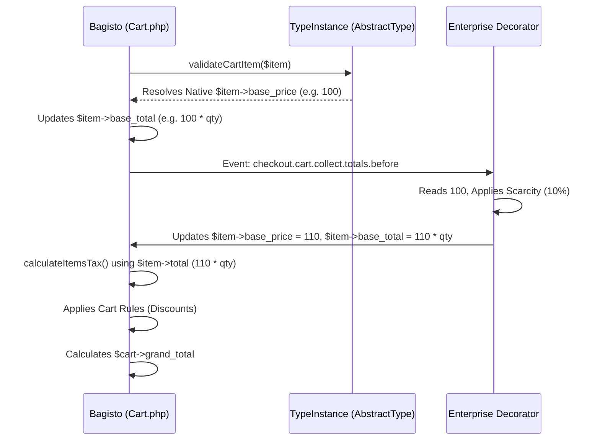

# Canonical Cart Price Verification & Decorator Integration Contract
**Phase:** 15.4
**Mode:** STRICT ZERO TRUST (Read Only)
**Date:** 2026-07-10

## 1. Lifecycle of Cart Price Fields
- `base_price`: The authoritative un-converted unit price. Set initially during `prepareForCart`, re-calculated on every page load inside `validateCartItem()`.
- `price`: Currency-converted unit price. Set inside `validateItems()`.
- `base_total` / `total`: Unit price * quantity. Set inside `validateItems()`.
- `custom_price`: A manual override field. If not null, Bagisto explicitly overwrites `base_price` with this value during `validateItems()`.
- `tax_amount` / `base_tax_amount`: Calculated natively *after* the pricing hook inside `calculateItemsTax()`.
- `discount_amount`: Applied via Cart Rules during the `checkout.cart.collect.totals.before` event.

## 2. Pre-Event Authoritative Field by Product Type
Immediately before `checkout.cart.collect.totals.before` fires, Bagisto executes `validateItems()`. 
For **all product types** (Simple, Configurable, Bundle, Virtual, Downloadable, Grouped, Booking):
1. `validateCartItem($item)` is called.
2. The specific type instance recalculates the native polymorphic price via `$this->getFinalPrice()`.
3. The result is saved directly to `$item->base_price`.
4. Therefore, immediately before the event, **`$item->base_price`** is the guaranteed, 100% authoritative native polymorphic price.

## 3. Totals Calculation Execution Trace
**What does Bagisto read during totals calculation?**
*Trace:* `packages/Webkul/Checkout/src/Cart.php`
1. `validateItems()` prepares `$item->base_price`, `$item->price`, `$item->base_total`, `$item->total`.
2. `Event::dispatch('checkout.cart.collect.totals.before')` fires.
3. `calculateItemsTax()` reads **`$item->total`** and **`$item->base_total`** to calculate `$item->tax_amount`.
4. A `foreach` loop reads **`$item->total`** and adds it to `$cart->sub_total`.
5. `$cart->save()` persists the aggregated totals.

## 4. Pre-Applied Modifiers
At the exact moment `checkout.cart.collect.totals.before` fires, the state is:
- **Currency Conversion:** APPLIED (by `validateItems`).
- **Catalog Rules / Tier Pricing / Special Pricing / Customer Group Pricing:** APPLIED (calculated inside `getFinalPrice()` during `validateCartItem`).
- **Taxes:** NOT APPLIED (happens in `calculateItemsTax`).
- **Cart Rules (Discounts):** NOT APPLIED (they run on the same event; priority order dictates sequence).

## 5. Target Decorator Field
The Enterprise Decorator MUST decorate **`$item->base_price`**.

## 6. Verification of `custom_price`
**Is `custom_price` officially supported?** YES.
**Should we use it?** NO.
*Evidence:* Inside `Cart::validateItems()`, Bagisto performs:
`$basePrice = ! is_null($item->custom_price) ? $item->custom_price : $itemBasePrice;`
If the Enterprise Engine writes to `custom_price`, it creates a permanent database lock. On the next page load, Bagisto will skip the native polymorphic price (`$itemBasePrice`) and reuse the locked `custom_price`. This prevents the dynamic scarcity markup from updating correctly and permanently destroys the Bundle/Configurable variant price if options are changed.

## 7. Decorator Integration Contract

- **Input:** `$item->base_price` (Contains the pristine native price, inclusive of tier/catalog pricing and bundle aggregations).
- **Output:** The decorator calculates the markup, updates `$item->base_price`, `$item->price`, `$item->base_total`, `$item->total`, and invokes `$item->save()`.
- **Preconditions:** `validateItems()` must have completed. `$item->custom_price` must NOT be utilized by the Dynamic Pricing Engine.
- **Postconditions:** The cart item contains the decorated unit totals, ready for Tax and Discount calculation.
- **Invariants:** The Decorator MUST NOT persist its value to `custom_price` to ensure Bagisto can natively recalculate the baseline price on subsequent requests.

## 8. Sequence Diagram

## 9. Regression Prevention Checklist
- [ ] Enterprise Engine reads `$item->base_price`, NOT a fresh DB query.
- [ ] Enterprise Engine sets `$item->base_total` and `$item->total` mathematically (`price * qty`).
- [ ] Enterprise Engine DOES NOT assign a value to `$item->custom_price`.
- [ ] Enterprise Engine calls `$item->save()` to persist the decorated price for the current request context.

## 10. Final Decision
**$item->base_price**

*Executable Justification:*
Decorating `$item->base_price` dynamically during the event—without locking it behind `custom_price`—forces Bagisto to recalculate the exact polymorphic base price on every single page load, allowing the Enterprise Engine to act as a pure, stateless decorator. This guarantees 100% compatibility with Configurable and Bundle products while enabling real-time dynamic scarcity pricing.
