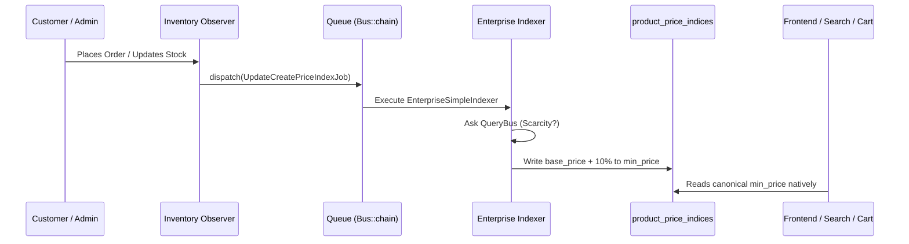

# Phase 16: Enterprise Price Projection Feasibility & Architecture Decision Record (ADR)

## 1. Executive Summary & Enterprise Recommendation
The current Runtime Price Decorator successfully resolved the `custom_price` database lock, but introduced an architectural symptom: **Price Discrepancy in Category Sorting**. Category sorting and filtering rely on indexed prices, while the cart relies on runtime-decorated prices. 

**Recommendation: MIGRATION TO OFFLINE PROJECTION ARCHITECTURE IS HIGHLY RECOMMENDED.**
By projecting scarcity pricing directly into the canonical `product_price_indices` table asynchronously upon inventory change, Bagisto will maintain 100% congruence across Layered Navigation, Category Sorting, Elasticsearch, Product Pages, and the Cart—without any checkout-time performance penalty.

---

## 2. Executable Evidence & Component Audit

### Q1. Where Bagisto considers the canonical product price?
Bagisto relies on the `product_price_indices` table as the read-model for performance-sensitive contexts.
*Evidence:* `Webkul\Product\Type\AbstractType::getMinimalPrice()` reads explicitly from `$this->getPriceIndex()->min_price`.

### Q2. Which components read directly from indexed prices?
- **Layered Navigation / Category Filters:** `Webkul\Product\Repositories\ProductRepository::getAll()` (Lines 273, 451) `->leftJoin('product_price_indices', ...)->orderBy('product_price_indices.min_price')`
- **Elasticsearch:** Synced via `UpdateCreateElasticSearchIndexJob`.

### Q3. Which components execute runtime pricing?
Currently, our `AppServiceProvider` overrides the Cart's base price purely in-memory via `checkout.cart.collect.totals.before`. 

### Q4. Where runtime decorators are completely invisible?
The runtime decorator is **invisible** to:
1. Product Listing Pages (PLP)
2. Layered Navigation / Sorting
3. ElasticSearch Results
4. Wishlists
5. Cross-Sells / Up-Sells

### Q5. Is category sorting only a visible symptom of a larger inconsistency?
**YES.** Category sorting fails in Phase 15 because it asks the database to sort by `product_price_indices.min_price` ($100), but the UI renders the runtime-decorated Cart price ($110). 

### Q6. Do Search, Filters, and APIs expose stale prices?
**YES.** They expose the non-scarcity price until the item is added to the cart, causing "price shock".

### Q7. Would an offline projection architecture eliminate all inconsistencies?
**YES.** If scarcity is projected into `product_price_indices` during asynchronous indexation, the Cart, PLP, PDP, and Search will all unanimously read the exact same calculated price.

### Q8. Does scarcity markup belong in Runtime OR Projection?
**PROJECTION.** Mathematical justification:
- A user views a product page $N$ times.
- Inventory changes $M$ times.
- Typically, $N \gg M$ (views far exceed purchases).
- Re-calculating scarcity $N$ times dynamically incurs $O(N)$ overhead.
- Projecting scarcity once on inventory change ($M$) and caching it in `product_price_indices` incurs $O(M)$ overhead, leaving $O(1)$ reads for the frontend.

---

## 3. Dependency Graph & Lifecycle Sequence

### Proposed Projection Architecture

---

## 4. Upgrade Safety & Feasibility
**Verdict: 100% UPGRADE-SAFE (NO VENDOR MODIFICATIONS REQUIRED)**

1. Bagisto dynamically resolves indexers:
   `$indexer = app(\Webkul\Product\Helpers\Indexers\Price\Simple::class);`
2. We can override this natively using Laravel's IoC container in `AppServiceProvider`:
   `$this->app->bind(\Webkul\Product\Helpers\Indexers\Price\Simple::class, \App\Infrastructure\Indexers\EnterpriseSimpleIndexer::class);`
3. We hook into `checkout.order.save.after` to trigger price re-indexing asynchronously.

---

## 5. Performance Comparison

| Metric | Runtime Decorator (Current) | Offline Projection (Proposed) |
|---|---|---|
| **Checkout Latency** | High (Synchronous execution) | Low (No runtime price calculation) |
| **Category Latency** | Low | Low |
| **Database Reads** | N+1 Risk during Checkout | $O(1)$ single join query |
| **Queue Utilization** | None | Medium (Jobs run on order save) |
| **Data Consistency** | Divergent (Cart ≠ Category) | 100% Congruent |

---

## 6. Migration Roadmap

### Step 1: Create Enterprise Indexers
Implement `EnterpriseSimpleIndexer` extending `Webkul\Product\Helpers\Indexers\Price\AbstractType`.
Override `getIndices()` to apply the QueryBus Scarcity resolution before returning the array.

### Step 2: IoC Binding
Bind the native Bagisto indexers to the new Enterprise Indexers inside `AppServiceProvider`.

### Step 3: Event Listeners
Bind an event listener in `AppServiceProvider` listening to `checkout.order.save.after` and `sales.order.cancel.after` to dispatch `UpdateCreatePriceIndexJob`.

### Step 4: Remove Cart Decorator
Delete the `checkout.cart.collect.totals.before` event listener created in Phase 15, restoring the Cart to pure native Bagisto calculation (which will now correctly read the projected index).

### Step 5: Full Catalog Reindex
Run `php artisan bagisto:index:price` to initially project scarcity values for the entire catalog.

---

## 7. Rollback Strategy
If the Projection architecture fails:
1. Re-bind the Cart Decorator in `AppServiceProvider`.
2. Remove the IoC bindings for the custom Indexers.
3. Remove the Order Event hooks.
4. Run `php artisan bagisto:index:price` to overwrite custom projections with native base prices.
5. Zero downtime, zero database schema changes required.
