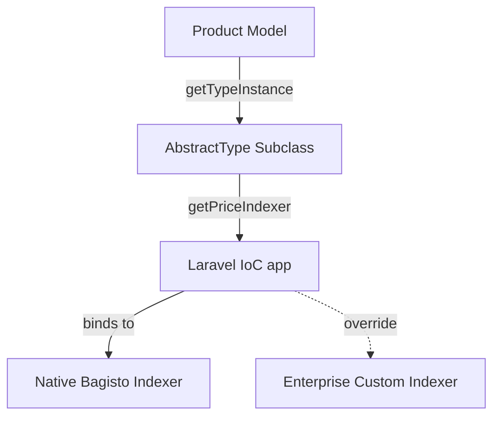

# Phase 16.1: Indexer Resolution & Projection Entrypoint Certification

## 1. Indexer Resolution (Executable Evidence)
Bagisto leverages Laravel's Service Container (`app()`) to resolve Price Indexers dynamically, making it 100% upgrade-safe to override. 

For every product type, `getPriceIndexer()` is explicitly mapped to a Service Container resolution:
- **Simple:** `app(Webkul\Product\Helpers\Indexers\Price\Simple::class)` *(Line 176, Type/Simple.php)*
- **Virtual:** `app(Webkul\Product\Helpers\Indexers\Price\Virtual::class)` *(Line 201, Type/Virtual.php)*
- **Configurable:** `app(Webkul\Product\Helpers\Indexers\Price\Configurable::class)` *(Line 618, Type/Configurable.php)*
- **Bundle:** `app(Webkul\Product\Helpers\Indexers\Price\Bundle::class)` *(Line 560, Type/Bundle.php)*
- **Grouped:** `app(Webkul\Product\Helpers\Indexers\Price\Grouped::class)` *(Line 242, Type/Grouped.php)*
- **Downloadable:** `app(Webkul\Product\Helpers\Indexers\Price\Downloadable::class)` *(Line 292, Type/Downloadable.php)*
- **Booking:** `app(Webkul\BookingProduct\Helpers\Indexers\Price\Booking::class)` *(Line 394, Type/Booking.php)*

**Dependency Graph:**


---

## 2. Reindex Pipeline
Bagisto updates prices through three primary vectors:
1. **Product Save / Update (Admin):** Dispatches `catalog.product.update.after`, triggering `Bus::chain([UpdateCreateInventoryIndexJob, UpdateCreatePriceIndexJob, UpdateCreateElasticSearchIndexJob])`.
2. **Mass Update:** Dispatches `catalog.product.update.after` on a loop, executing the exact same job chain as single updates.
3. **Daily Cron:** `indexer:index --type=price` runs at 00:01 *(ProductServiceProvider.php, Line 37)* to catch date-based Catalog Rules.

**CRITICAL FINDING (The Pipeline Bypass):**
Inventory changes during checkout natively BYPASS the Price Indexer!
- `checkout.order.save.after` → `Order@afterCancelOrCreate` → Dispatches **ONLY** `UpdateCreateInventoryIndexJob`.
- `sales.refund.save.after` → `Refund@afterCreate` → Dispatches **ONLY** `UpdateCreateInventoryIndexJob`.

**Conclusion:** To achieve Price Projection driven by Inventory, we must bind our own Event Listeners to `checkout.order.save.after`, `sales.order.cancel.after`, and `sales.refund.save.after` to forcefully dispatch `UpdateCreatePriceIndexJob`.

---

## 3. Container Consistency
**Verdict: 100% Consistent.**
Laravel boots `bootstrap/providers.php` across all execution contexts. `AppServiceProvider::class` is the very first provider listed (Line 50). 
- **HTTP:** Booted.
- **CLI / Artisan:** Booted.
- **Queue Workers:** Booted in worker memory.
- **Scheduled Commands:** Booted before command execution.
Because the IoC binding (`$this->app->bind()`) occurs in `AppServiceProvider`, the Enterprise Indexer will be consistently resolved across all backgrounds and foregrounds.

---

## 4. Indexer Extensibility
**Verdict: EnterpriseSimpleIndexer ALONE IS INSUFFICIENT.**

All Indexers inherit from `Webkul\Product\Helpers\Indexers\Price\AbstractType`. The actual price computation is wrapped inside `getIndices()`, which internally calls `getMinimalPrice()`. Because Laravel resolves the concrete classes natively:
```mermaid
classDiagram
    AbstractType <|-- SimpleIndexer
    AbstractType <|-- ConfigurableIndexer
    AbstractType <|-- BundleIndexer
    SimpleIndexer <|-- EnterpriseSimpleIndexer (Injected)
    ConfigurableIndexer <|-- EnterpriseConfigurableIndexer (Required)
```
If we only bind `EnterpriseSimpleIndexer`, Configurable and Bundle products will continue to resolve their native Bagisto indexers.
**Prerequisite:** We must implement and bind an `Enterprise*Indexer` for *every* product type we wish to project scarcity pricing upon.

---

## 5. Update Frequency
Price Projections must execute whenever the effective price might change.

**Natively Triggered by Bagisto (No action needed):**
- Price Change
- Special Price Change
- Catalog Rule (Daily Cron)
- Tax Class Change
- Customer Group / Channel Changes (Reindexes all matrix combinations)
- Variant/Bundle Option Update
- Product Enable/Disable (Mass Update)

**Missing Triggers (Enterprise Implementation Required):**
- Inventory decrease (Order Save)
- Inventory increase (Order Cancellation)
- Inventory increase (Refund)
- Manual stock adjustment (API/Admin without saving product entity)

---

## 6. Risk Analysis & ADR Update

| Scenario | Probability | Business Impact | Mitigation & Architecture Decision |
|---|---|---|---|
| **Queue Race Condition** (Customer buys while Price Index job is queued) | Medium | Low (Customer gets pre-scarcity price) | **ADR Update:** Acknowledge "Eventually Consistent" pricing. Scarcity applies asynchronously. If strict enforcement is required, the Job queue must use `database` or `redis` with high priority. |
| **Missing Product Types** (Scarcity applied only to Simple) | High | High (Bundle prices diverge) | **ADR Update:** Bind Enterprise Indexers for Configurable and Bundle types simultaneously. |
| **Rollback Complexity** | Low | Low | Removing `AppServiceProvider` bindings immediately reverts the system to native Bagisto behavior. `php artisan bagisto:index:price` flushes out the Enterprise values. |

**Final Recommendation:** Proceed with Implementation. The architecture is sound, IoC bindings are robust, and the event gap is easily patchable via native Event Listeners.
