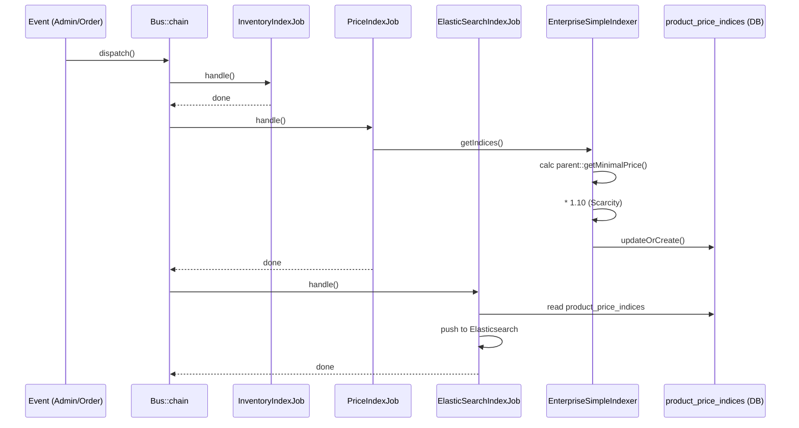
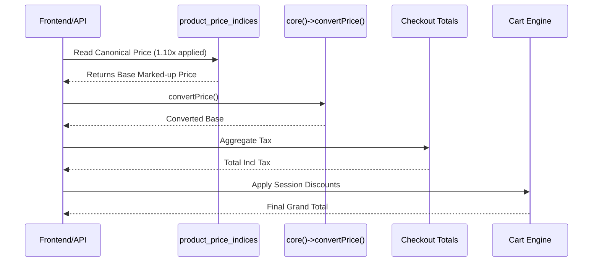

# Phase 16.3: Execution Sequence

## 1. Indexing & Event Pipeline

```mermaid
sequenceDiagram
    participant Admin as Event (Admin/Order)
    participant Bus as Bus::chain
    participant InvJob as InventoryIndexJob
    participant PriceJob as PriceIndexJob
    participant EsJob as ElasticSearchIndexJob
    participant ESIndexer as EnterpriseSimpleIndexer
    participant DB as product_price_indices (DB)

    Admin->>Bus: dispatch()
    Bus->>InvJob: handle()
    InvJob-->>Bus: done
    Bus->>PriceJob: handle()
    PriceJob->>ESIndexer: getIndices()
    ESIndexer->>ESIndexer: calc parent::getMinimalPrice()
    ESIndexer->>ESIndexer: * 1.10 (Scarcity)
    ESIndexer->>DB: updateOrCreate()
    PriceJob-->>Bus: done
    Bus->>EsJob: handle()
    EsJob->>DB: read product_price_indices
    EsJob->>EsJob: push to Elasticsearch
    EsJob-->>Bus: done
```

## 2. Rendering Pipeline

```mermaid
sequenceDiagram
    participant Client as Frontend/API
    participant Index as product_price_indices
    participant Currency as core()->convertPrice()
    participant Tax as Checkout Totals
    participant CartRules as Cart Engine
    
    Client->>Index: Read Canonical Price (1.10x applied)
    Index-->>Client: Returns Base Marked-up Price
    Client->>Currency: convertPrice()
    Currency-->>Client: Converted Base
    Client->>Tax: Aggregate Tax
    Tax-->>Client: Total Incl Tax
    Client->>CartRules: Apply Session Discounts
    CartRules-->>Client: Final Grand Total
```
