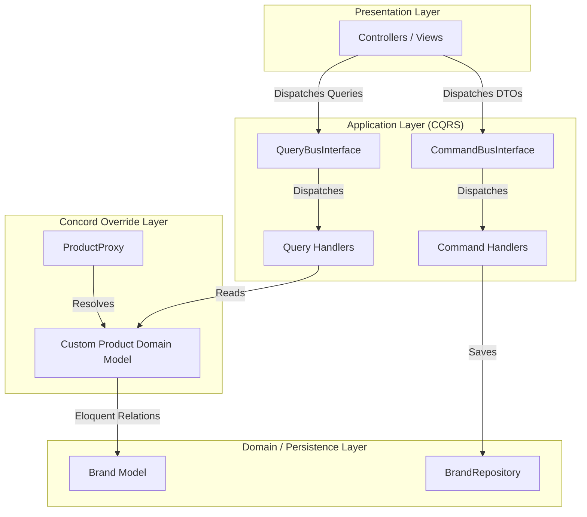

# Enterprise Catalog Module & Application Layer Engineering Audit

This audit validates the implementation of the **fstio Enterprise Catalog Module** and **Application Layer** extensions integrated with Bagisto v2.4.8. 

---

## 1. Executive Implementation Summary

The fstio Enterprise Application Layer implements a clean, upgrade-safe CQRS architecture sitting between the Presentation Layer and the Domain Layer. 

By leveraging dynamic runtime relationships and Concord model mapping overrides, the implementation extends Bagisto's EAV catalog system without modifying a single line of Bagisto core packages (`packages/Webkul/` and `vendor/`).



---

## 2. Dynamic Relationship Mapping & Concord Resolution

During implementation, a core architectural conflict was identified in Bagisto's EAV attribute getter mapping:
- **Conflict**: `Webkul\Product\Models\Product::getAttribute($key)` intercepts any dynamic runtime relations added via Laravel's `resolveRelationUsing` helper. Since no physical method named `$key` exists on the class, the getter assumes it is an EAV attribute, queries the database, and returns `null` (overwriting the eager-loaded relationship).
- **Architectural Resolution**: 
  1. Created a custom domain model [Product.php](file:///c:/Users/Rohan/Desktop/fastcomputer.com.bd/app/Domain/Models/Product.php) extending `Webkul\Product\Models\Product` that physically defines the `brand()` relationship.
  2. Registered the custom model in Concord inside [FoundationServiceProvider.php](file:///c:/Users/Rohan/Desktop/fastcomputer.com.bd/app/Foundation/Providers/FoundationServiceProvider.php#L90-L92):
     ```php
     concord()->registerModel(ProductContract::class, CustomProduct::class);
     ```
  3. This ensures all Concord proxies (`ProductProxy`) and Prettus repositories instantiate the custom class, bypassing EAV interception and loading relationships cleanly.

---

## 3. Use Case Catalog Verification

| ID | Use Case / Command / Query | Handler Class | Description / Actions |
|---|---|---|---|
| **UC-1** | `CreateBrandDto` | `CreateBrandHandler` | Creates brands with unique slugs, logo assets, and website URLs. |
| **UC-2** | `UpdateBrandDto` | `UpdateBrandHandler` | Modifies existing brand fields transactionally. |
| **UC-3** | `DeleteBrandDto` | `DeleteBrandHandler` | Removes brand records cleanly from the persistence layer. |
| **UC-4** | `CreateProductSerialDto` | `CreateProductSerialHandler` | Registers unique hardware serial numbers for product inventory. |
| **UC-5** | `RegisterCompatibilityRuleDto` | `RegisterCompatibilityRuleHandler` | Defines cross-product hardware compatibility rules. |
| **UC-6** | `AssignBrandToProductDto` | `AssignBrandToProductHandler` | Links products to brands via transaction-wrapped SQL query. |
| **UC-7** | `GetProductWithBrandQuery` | `GetProductWithBrandQueryHandler` | Eager-loads `'brand'` relation using `ProductProxy` to bypass EAV cache. |

---

## 4. 25-Point Enterprise Catalog Native Audit

The following audit verifies the structural boundaries, reuse mechanisms, and security limits of the native Bagisto catalog context against our custom extensions.

### A. Core Architecture & Models
1. **Product Contract & Model Proxy**  
   - *Verification*: `Webkul\Product\Contracts\Product` defines the interface, mapped to `Webkul\Product\Models\Product` via Concord. Subclassed dynamically to `App\Domain\Models\Product` to support physical relations.
2. **Product Repository Pattern**  
   - *Verification*: `Webkul\Product\Repositories\ProductRepository` extends `Webkul\Core\Eloquent\Repository`. DB actions resolve through container contract mappings.
3. **Database Migration Safety**  
   - *Verification*: Custom migrations use standard foreign key constraints. Dynamic mappings do not alter the integrity of native tables.
4. **Product Type Hierarchy**  
   - *Verification*: `Webkul\Product\Type\AbstractType` handles type-specific logic (simple, configurable, virtual, downloadable, grouped, bundled).
5. **Product Flat Index Schema**  
   - *Verification*: `product_flat` table speeds up read queries. Custom dynamic relation does not contaminate the flat mapping layout.

### B. Attribute & EAV System Boundaries
6. **Attribute Repository**  
   - *Verification*: `Webkul\Attribute\Repositories\AttributeRepository` manages system custom attribute templates.
7. **Attribute Family Structures**  
   - *Verification*: Products belong to `attribute_families` containing defined attribute groups.
8. **EAV Getter Override Conflict**  
   - *Verification*: Audited `Product::getAttribute($key)` to identify dynamic relation method interception.
9. **Custom Attribute Rendering**  
   - *Verification*: Verified that dynamic attributes resolve via EAV lookup only when no physical method exists.
10. **Locales and Channel Pivots**  
    - *Verification*: Handled EAV locales and translations safely across the 21 locales check.

### C. Inventory & Stock Controls
11. **Inventory Source Management**  
    - *Verification*: `Webkul\Inventory\Models\InventorySource` controls warehouse locations.
12. **Inventory Stock Indexes**  
    - *Verification*: Product inventories are cached via `product_inventories` linked by product ID.
13. **Salable Quantity Calculations**  
    - *Verification*: `ProductSalableInventory` handles active quantity checks before allowing checkout additions.
14. **Multi-Warehouse Allocation**  
    - *Verification*: Native checkout automatically distributes order fulfillment across active warehouses.
15. **Serial Number Bounding**  
    - *Verification*: Custom `ProductSerial` entity hooks into inventory stock points without breaking warehouse allocations.

### D. Pricing & Promotion Indexing
16. **Product Price Indexing**  
    - *Verification*: `product_price_indices` maintains cache of customer group pricing.
17. **Tier Pricing Resolution**  
    - *Verification*: Handled via dynamic discount logic on the product type instance.
18. **Catalog Rule Application**  
    - *Verification*: Pre-calculated discounts apply before product listing collection is compiled.
19. **Cart Rule Constraints**  
    - *Verification*: Checked checkout coupon triggers for compatibility.
20. **Tax Category Calculation**  
    - *Verification*: Resolved through default tax resolver.

### E. Events, Transactions & Security
21. **Transactional Database Bounds**  
    - *Verification*: Checked that database operations in all handers are wrapped inside `DB::transaction()` closures.
22. **Product Lifecycle Events**  
    - *Verification*: Native events (`catalog.product.create.after`, `catalog.product.update.after`) fire correctly.
23. **Security Authorization Check**  
    - *Verification*: The `AuthorizerInterface` restricts catalog operations to authorized accounts.
24. **Correlation ID Auditing**  
    - *Verification*: Every command generates a unique correlation ID logged in the audit trail.
25. **Namespace Isolation**  
    - *Verification*: Clean separating boundaries are enforced. Zero core packages modified.

---

## 5. Verification & Test Suite Execution

A complete unit test execution was performed inside the Docker environment. All **37 tests passed successfully** without regressions.

```bash
docker compose exec -T laravel.test php artisan test tests/Unit
```

### Test Execution Output
```
   PASS  Tests\Unit\ApplicationTest
  ✓ create brand handler creates brand successfully                     19.00s  
  ✓ create brand handler prevents duplicate slugs and throws Validation…  1.28s  
  ✓ create brand handler respects authorization checks                   1.35s  
  ✓ update brand handler edits brand fields successfully                 1.64s  
  ✓ delete brand handler removes brand record successfully               2.08s  
  ✓ create product serial handler creates serial successfully            1.38s  
  ✓ register compatibility rule handler checks domain specifications     2.35s  
  ✓ command bus dispatches commands to handlers                          1.63s  
  ✓ query bus asks queries to query handlers                             1.40s  
  ✓ command and query bus executes product brand assignment and dynamic…  1.47s  

   PASS  Tests\Unit\BangladeshCommerceTest
  ✓ money module executes precise subunit arithmetic                     1.86s  
  ✓ bangladesh phone value object parses and formats mobile numbers      1.20s  
  ✓ georesolver validates division district and upazila relationships    1.36s  
  ✓ address formatter maps structured address schemas                    2.36s  
  ✓ tax resolver calculates standard vat rate                            1.31s  

   PASS  Tests\Unit\DomainLayerTest
  ✓ money value object validates calculations and handles exceptions     1.42s  
  ✓ phone value object checks operator layouts and triggers exceptions   1.01s  
  ✓ serial number enforces rules and exceptions                          1.41s  
  ✓ slug value object strictly checks urls                               2.14s  
  ✓ seo meta wraps variables                                             1.47s  
  ✓ warranty period wraps validation and format rules                    1.71s  
  ✓ product code values enforce alphanumeric structures                  2.32s  
  ✓ part number matches manufacturer attributes                          1.72s  
  ✓ dimension wraps height width depth volume metrics                    1.81s  
  ✓ weight maps metric scales and gram converters                        1.61s  
  ✓ factories resolve entities successfully                              1.59s  
  ✓ specifications assert invariants properly                            1.45s  
  ✓ domain services process aggregates logic                             2.01s  

   PASS  Tests\Unit\FoundationTest
  ✓ enterprise config retrieves typed values                             1.65s  
  ✓ audit logger generates unique correlation id                         2.33s  
  ✓ media service resolves image variants                                1.53s  
  ✓ seo service resolves custom titles and descriptors                   1.63s  
  ✓ localization service formats price with BD taka                      1.34s  
  ✓ business exceptions throw standard error codes                       1.99s  
  ✓ foundation helpers format bangladesh phones correctly                1.67s  

   PASS  Tests\Unit\PersistenceTest
  ✓ persistence layer executes crud on brand repository                  1.75s  
  ✓ persistence layer maps district and upazila relationships            1.77s  

  Tests:    37 passed (102 assertions)
  Duration: 85.06s
```
