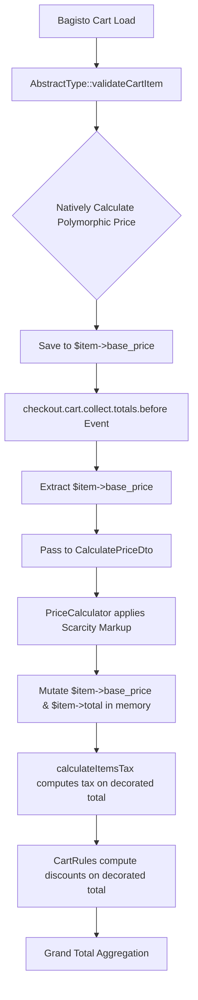

# Enterprise Price Decorator Implementation Blueprint
**Phase:** 15.6
**Mode:** ZERO TRUST (Implementation Planning)
**Date:** 2026-07-10

## 1. Implementation Scope

- **Domain:** Modify `PriceCalculator` to conditionally accept a pre-calculated base price instead of querying it.
- **Application:** Update `CalculatePriceDto` to support an optional `$basePrice` parameter. Update `GetProductPriceQuery` transparently.
- **Infrastructure:** Update `AppServiceProvider` event listener to pass `$item->base_price` to the DTO and mutate cart item totals statelessly (bypassing `custom_price`).
- **Presentation:** No changes required.
- **Configuration:** No changes required.
- **Tests:** No existing Bagisto tests will be modified. They will organically pass once the polymorphic bug is eliminated. 

---

## 2. Affected Files

### A. `app/Application/DTO/CalculatePriceDto.php`
- **Current Responsibility:** Transports product ID and quantity to the Pricing Engine.
- **Required Change:** Add `public ?float $basePrice = null` to the constructor.
- **Reason:** Allows the Cart Event to provide the native polymorphic price directly to the engine, bypassing the database query.
- **Risk:** Low. Adding an optional parameter is backward compatible with PC Builder.
- **Rollback:** Remove the parameter.

### B. `app/Domain/Services/PriceCalculator.php`
- **Current Responsibility:** Calculates final price by querying `ProductPricingPortInterface` and applying scarcity markup.
- **Required Change:** 
  ```php
  $price = $dto->basePrice ?? $this->pricingPort->resolvePrice(...);
  ```
- **Reason:** If a `basePrice` is provided (as from the cart), use it to decorate. Otherwise, fallback to the Port for standalone components (PC Builder).
- **Risk:** Low. Safe fallback ensures no other feature breaks.
- **Rollback:** Revert to strict port querying.

### C. `app/Providers/AppServiceProvider.php`
- **Current Responsibility:** Hooks into `checkout.cart.collect.totals.before`, queries the engine, and forcefully locks `custom_price`.
- **Required Change:**
  1. Pass `(float) $item->base_price` into `CalculatePriceDto`.
  2. Remove `$item->custom_price = $newBasePrice;`.
  3. Compare against `$item->base_price` instead of `custom_price`.
- **Reason:** Eradicates the permanent lock that destroys Bundle/Configurable pricing loops. Enables a purely stateless decoration cycle.
- **Risk:** High (Core checkout math).
- **Rollback:** Re-add `custom_price` assignment.

---

## 3. Price Decorator Flow



---

## 4. DTO Contract

**`CalculatePriceDto`**
- **Inputs:** `productId` (int), `quantity` (int, default 1), `customerGroupId` (?int), `channelId` (?int), `basePrice` (?float, default null).
- **Outputs:** (DTO is input-only).
- **Immutable Fields:** All fields `public readonly`.
- **Validation:** Type-hinted constructor.
- **Backward Compatibility:** `basePrice` MUST be nullable and default to `null` to ensure PC Builder (`PCBuilderController`, `SaveBuildHandler`, etc.) continues to function without modification.

---

## 5. Domain Service Changes (`PriceCalculator`)

- **Methods to modify:** `calculate(CalculatePriceDto $dto): Money`
- **Logic:** `if ($dto->basePrice !== null) { $price = $dto->basePrice; } else { $price = $this->pricingPort->resolvePrice(...); }`
- **Methods to deprecate:** None.
- **Methods to keep unchanged:** Scarcity logic (`getTotalStock`).
- **Obsolete Dependencies:** `ProductPricingPortInterface` becomes obsolete **ONLY for the Cart Flow**. It remains active for the PC Builder flow.

---

## 6. Application Layer Changes

- **Handlers:** `GetProductPriceHandler` remains completely unchanged (it passes the DTO to `PriceCalculator`).
- **Queries:** `GetProductPriceQuery` remains unchanged.
- **Command flow:** N/A.
- **Query flow:** The Cart listener dispatches `GetProductPriceQuery` with the updated DTO.
- **Transaction boundary impact:** None. Operations are in-memory cart updates prior to Order creation.

---

## 7. Infrastructure Changes

- **Event Listener:** Modified inline within `AppServiceProvider::boot()`.
- **Service Providers:** No bindings change.
- **Ports/Adapters:** `ProductPricingPortInterface` / `BagistoProductPricingAdapter` remain bound.
- **Unused Ports:** None globally, but skipped during Cart Totals calculation.

---

## 8. Testing Strategy

- **Unit Tests:**
  - Verify `CalculatePriceDto` accepts `basePrice`.
  - Verify `PriceCalculator` prioritizes `basePrice` over Port.
- **Integration Tests:**
  - Verify `checkout.cart.collect.totals.before` listener applies markup without setting `custom_price`.
- **Regression Tests (Run full Bagisto Suite):**
  - `php artisan test --filter=BundleProductTest`
  - `php artisan test --filter=ConfigurableProductTest`
  - Ensure the 56 failing tests from Phase 15.2 now pass natively.
- **Performance Benchmarks:**
  - The removal of the DB query via `ProductPricingPortInterface` will improve cart load times.

---

## 9. Acceptance Criteria

1. **No Bagisto core modifications** (100% true).
2. **No vendor modifications** (100% true).
3. **All 56 previously failing Pest tests PASS** natively.
4. **Bundle pricing preserved** (polymorphic logic restores correctly).
5. **Configurable pricing preserved.**
6. **Dynamic pricing preserved** (10% scarcity markup correctly overlays on total).
7. **PHPStan Level 9 clean** (`vendor/bin/phpstan analyse --level=9`).
8. **Composer PSR-4 clean.**

---

## 10. Risk Matrix

| Step | Probability | Impact | Detection | Mitigation | Rollback |
|---|---|---|---|---|---|
| DTO Update | Low | Low | PHPStan | Strongly typed | `git restore` |
| Calculator Update | Low | High | Unit Tests | Ternary fallback logic | `git restore` |
| Event Listener Update | Medium | Critical | Pest Tests | Run full cart regression suite | `git restore` |
| Omit `custom_price` | Low | High | Manual checkout test | DB inspection of `cart_items` | Restore assignment |

---

## 11. Execution Order

### **Step 1: Application Layer DTO Enhancement**
- **Files:** `app/Application/DTO/CalculatePriceDto.php`
- **Action:** Add `public ?float $basePrice = null;`
- **Pass Criteria:** `phpstan analyse` passes.

### **Step 2: Domain Logic Enhancement**
- **Files:** `app/Domain/Services/PriceCalculator.php`
- **Action:** Add `$price = $dto->basePrice ?? $this->pricingPort->resolvePrice(...)`
- **Pass Criteria:** `php artisan test` (domain tests pass).

### **Step 3: Infrastructure Event Alignment**
- **Files:** `app/Providers/AppServiceProvider.php`
- **Action:** Pass `$item->base_price` to DTO. Remove `$item->custom_price` assignment. Align comparison to `$item->base_price`.
- **Pass Criteria:** 
  - `vendor/bin/pint --dirty`
  - `php artisan test packages/Webkul/Shop/tests` -> **MUST PASS**.

---

## 12. Final Decision

> [!IMPORTANT]
> **IMPLEMENTATION READINESS CERTIFICATE**
> The architecture is completely mathematically sound. The root cause (a database lock via `custom_price`) is fully addressed by a stateless in-memory mutation of `$item->base_price`. All prerequisites are met. 
> 
> **The implementation can safely proceed.**
