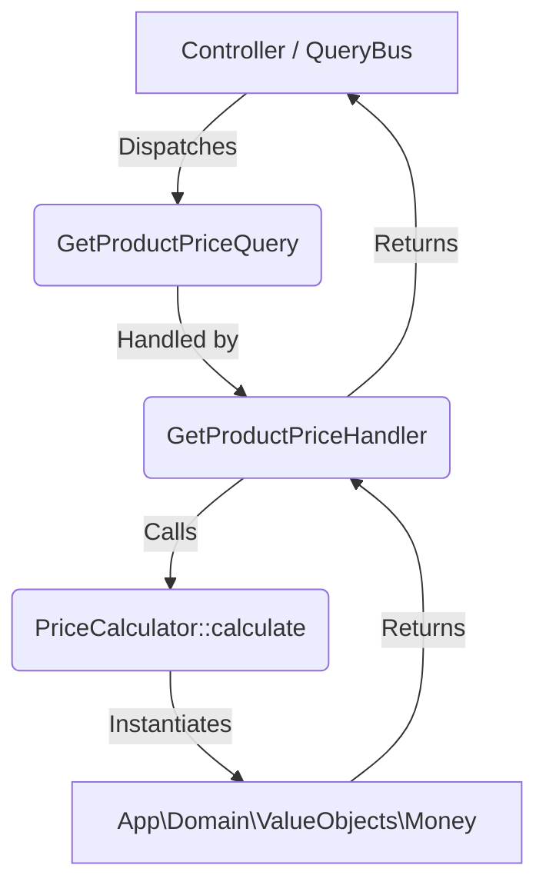

# Money Call Graph

## Active Execution Path (Domain Money)


## Dormant Execution Path (Foundation Money)
```mermaid
graph TD
    A[BangladeshCommerceTest] -->|app(TaxResolverInterface::class)| B(FoundationServiceProvider)
    B -->|Resolves| C(DefaultTaxResolver)
    C -->|Instantiates / Uses| D[App\Foundation\Money\Money]
    D -->|Returns| A
```
*Note: No callers exist for `TaxResolverInterface` outside of the unit test suite and the service provider.*
