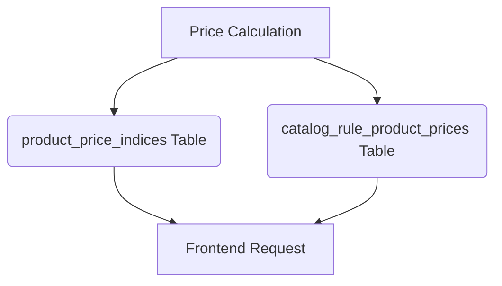

# Phase 6 Cache Graph

## Cache Topography

Bagisto largely bypasses standard Redis memory caching for core prices and relies instead on indexed database tables to serve as the price cache.

### Key Cache Stores
1. **`product_price_indices` (Database)**
   - **Generation**: Generated by `Webkul\Product\Helpers\Indexers\Price` via Queue Job.
   - **Invalidation**: Updated incrementally on `catalog.product.update.after`.
   - **Race Conditions**: Protected by database transaction boundaries within the Queue Worker.
   - **Stampede Risk**: Negligible (served from relational database with BTREE indexes).

2. **FPC (Full Page Cache)**
   - **Generation**: Generated by Spatie/ResponseCache or equivalent during HTTP response.
   - **Invalidation**: Flushed natively on `catalog.product.update.after` via `Webkul\FPC\Listeners\Product`.
