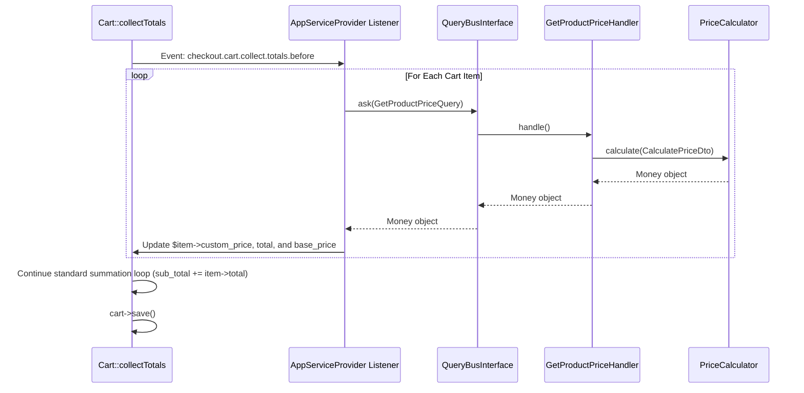

# Phase 7 Execution Trace

## Overlay Flow Graph

```mermaid
sequenceDiagram
    participant Cart as Cart::collectTotals
    participant AppProvider as AppServiceProvider Listener
    participant QueryBus as QueryBusInterface
    participant Handler as GetProductPriceHandler
    participant Calculator as PriceCalculator

    Cart->>AppProvider: Event: checkout.cart.collect.totals.before
    loop For Each Cart Item
        AppProvider->>QueryBus: ask(GetProductPriceQuery)
        QueryBus->>Handler: handle()
        Handler->>Calculator: calculate(CalculatePriceDto)
        Calculator-->>Handler: Money object
        Handler-->>QueryBus: Money object
        QueryBus-->>AppProvider: Money object
        AppProvider->>Cart: Update $item->custom_price, total, and base_price
    end
    Cart->>Cart: Continue standard summation loop (sub_total += item->total)
    Cart->>Cart: cart->save()
```
